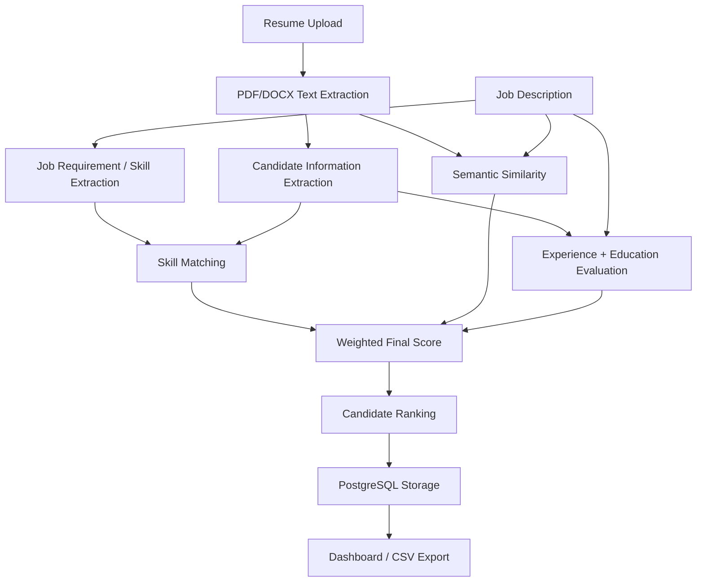
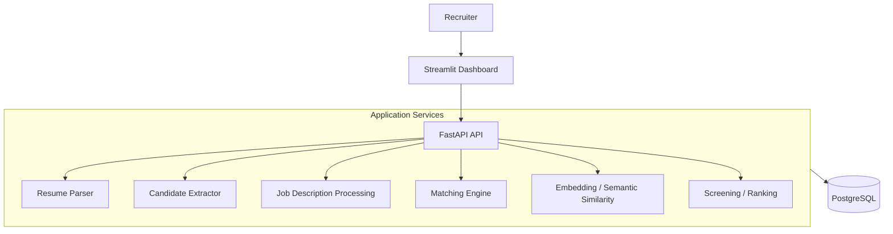

# AI Resume Screening System

This project is an automated resume screening and candidate ranking application designed to evaluate applicant resumes against specific job descriptions using skill extraction and semantic similarity analysis.

## 1. Overview

This application allows recruiters to upload candidate resumes in PDF or DOCX formats and evaluate them against a provided job description. It is designed for hiring managers and recruiters who need to process multiple applicants efficiently. By automating the extraction of candidate information and scoring the relevance of their experience and skills, the system solves the problem of manual, subjective resume screening, enabling a more consistent and scalable evaluation process.

## 2. Problem Statement

Recruiters frequently need to review dozens or hundreds of resumes against a single job description. Manual comparison is extremely time-consuming and can make it difficult to consistently identify relevant skills, evaluate technical experience, and rank candidates objectively without introducing human fatigue or bias. This project addresses the problem by programmatically extracting structured data from unstructured resumes and applying a standardized scoring algorithm to all candidates.

## 3. Solution

The system implements a multi-step screening pipeline. Resumes are uploaded through a web interface, parsed using text extraction libraries, and converted into plain text. The application then uses rule-based extraction to identify candidate details, skills, education, and experience. Simultaneously, the job description is analyzed to extract explicitly required technical skills based on a predefined skill dictionary. The system compares the candidate's skills with the job's requirements and calculates a semantic similarity score between the resume text and the job description. These signals are combined into a weighted final score (0–100), and candidates are ranked accordingly. This approach ensures the system relies on both explicit skill matching and semantic meaning, rather than solely on exact keyword overlap.

## 4. Key Features

- PDF resume processing
- DOCX resume processing
- Candidate information extraction
- Job description analysis
- Skill matching
- Matched skill identification
- Missing skill identification
- Semantic similarity
- Experience scoring
- Education scoring
- 0–100 scoring
- Candidate ranking
- PostgreSQL persistence
- FastAPI API
- Swagger documentation
- Streamlit dashboard
- CSV export
- Docker support
- Automated tests

## 5. System Workflow



## 6. System Architecture



- **Streamlit Dashboard**: Provides the user interface for recruiters to input job descriptions, upload resumes, and view ranked results.
- **FastAPI API**: Handles HTTP requests, file uploads, orchestration of the screening process, and database interactions.
- **Application Services**: Contains the core logic for text extraction, NLP, skill matching, and scoring computations.
- **PostgreSQL**: Stores persistent relational data including job descriptions, extracted candidate profiles, and individual screening scores.

## 7. Scoring Model

The system evaluates candidates using a weighted scoring model implemented in `app/services/matcher.py`.

| Component | Weight |
|---|---:|
| Skill Match | 50% |
| Semantic Similarity | 25% |
| Experience | 15% |
| Education | 10% |

Final Score =
    (Skill Match × 0.50)
  + (Semantic Similarity × 0.25)
  + (Experience × 0.15)
  + (Education × 0.10)

- **Skill Match**: The system extracts required technical skills from the job description and candidate skills from the resume using a predefined dictionary of common skills. The score is the percentage of required skills that the candidate possesses. It also identifies the specific matched skills and missing skills.
- **Semantic Similarity**: Uses the `Sentence Transformers` library with the `all-MiniLM-L6-v2` model to generate embeddings for both the full resume text and the job description. The score is based on the cosine similarity between these embeddings.
- **Experience**: The extracted professional experience and project sections are evaluated for semantic similarity against the job description. Professional experience is prioritized in the scoring calculation.
- **Education**: The extracted education section is evaluated for semantic similarity against the job description to gauge educational relevance.

## 8. Technology Stack

| Layer | Technology | Purpose |
|---|---|---|
| Language | Python 3.11 | Application development |
| API | FastAPI | REST API |
| Database | PostgreSQL | Persistent storage |
| ORM | SQLAlchemy | Database access |
| PDF Processing | PyMuPDF | PDF text extraction |
| DOCX Processing | python-docx | DOCX text extraction |
| NLP | Sentence Transformers | Semantic embeddings |
| Similarity | scikit-learn | Cosine similarity calculation |
| Frontend | Streamlit | Recruiter dashboard |
| Testing | pytest | Automated tests |
| Containerization | Docker | Application containerization |
| Orchestration | Docker Compose | Multi-container setup |

## 9. Project Structure

```text
app/
├── api/
│   ├── candidates.py
│   ├── jobs.py
│   ├── jobs_read.py
│   ├── results.py
│   ├── resumes.py
│   ├── screening.py
│   └── __init__.py
├── core/
│   └── __init__.py
├── database/
│   ├── database.py
│   └── __init__.py
├── models/
│   ├── candidate.py
│   ├── job.py
│   ├── screening_result.py
│   └── __init__.py
├── schemas/
│   └── __init__.py
├── services/
│   ├── embedding.py
│   ├── extractor.py
│   ├── matcher.py
│   ├── resume_parser.py
│   ├── screening.py
│   └── __init__.py
└── main.py
frontend/
└── dashboard.py
tests/
├── test_api.py
├── test_matcher.py
└── __init__.py
data/
├── resumes/
└── test_resumes/
.dockerignore
.env
.gitignore
.streamlit/
└── config.toml
docker-compose.yml
Dockerfile
README.md
requirements.txt
```

## 10. API Endpoints

| Method | Endpoint | Purpose |
|---|---|---|
| GET | `/` | Root endpoint, returns API status message |
| GET | `/health` | Health check endpoint |
| POST | `/resumes/upload` | Upload a single resume and extract candidate information |
| POST | `/jobs/match` | Compare candidate explicit skills against a job description |
| GET | `/jobs/` | Retrieve all stored job descriptions |
| POST | `/screen/` | Screen multiple resumes against a job description and return ranked results |
| GET | `/candidates/` | Retrieve all stored candidate profiles |
| GET | `/screening-results/` | Retrieve all stored screening result scores |

Swagger UI interactive documentation is available at:
http://localhost:8000/docs

## 11. Dashboard

The Streamlit dashboard (`frontend/dashboard.py`) provides the user interface for the screening process. It features a text area for job description input and a file uploader that accepts multiple PDF or DOCX resumes. Upon submission, the dashboard triggers the screening API and displays the evaluated candidates sorted by their final match score. The interface presents detailed candidate information, the overall match score, and specific breakdowns of matched and missing skills. It also includes functionality to export the full screening results to a CSV file.

## 12. Database

The application uses PostgreSQL with SQLAlchemy ORM, defining three primary models in `app/models/`:
- **Job**: Stores the raw job description text and creation timestamp.
- **Candidate**: Stores the extracted candidate information, including name, email, phone, parsed skills (stored as JSONB arrays), education text, experience text, projects text, and certifications (JSONB arrays).
- **ScreeningResult**: Links a Candidate and a Job via foreign keys. It stores the granular scoring metrics (skill match score, semantic similarity score, experience score, education score) and the overall match score. It also stores arrays of the specific matched and missing skills as JSONB.

## 13. Resume Processing

Resumes are parsed based on their file extension. PDF extraction is handled by PyMuPDF (`fitz`), and DOCX extraction is handled by `python-docx`. Once the raw text is extracted, the `extractor.py` service uses a combination of regular expressions and rule-based parsing to identify structured fields. It extracts the candidate's name, email, and phone number, and identifies specific resume sections (like education, experience, projects, and certifications) by looking for common section headers. Technical skills are extracted by matching the text against a predefined dictionary of common software engineering terms using word-boundary matching.

## 14. Semantic Matching

To evaluate the contextual relevance of a resume beyond exact keyword matches, the system uses semantic similarity. The `embedding.py` service uses the `all-MiniLM-L6-v2` model from `Sentence Transformers` to convert both the parsed resume text (or specific sections like experience) and the job description into dense vector embeddings. It then calculates the cosine similarity between these embeddings using `scikit-learn`. This semantic score contributes 25% to the final candidate match score.

## 15. Running the Project

### Prerequisites
- Python 3.11
- Docker Desktop
- PostgreSQL (if running locally outside Docker)
- Git

### Docker Setup

Build the images:
```bash
docker compose build
```

Start the containers in the background:
```bash
docker compose up -d
```

Verify the containers are running:
```bash
docker compose ps
```

The system uses two containers:
- FastAPI API container
- PostgreSQL database container

To stop the system:
```bash
docker compose down
```

### API

Base API:
http://localhost:8000

Health check:
http://localhost:8000/health

Swagger UI:
http://localhost:8000/docs

### Streamlit

To run the Streamlit dashboard locally on Windows:
```powershell
.\.venv\Scripts\Activate.ps1
streamlit run .\frontend\dashboard.py
```

## 16. Testing

The project includes an automated test suite using `pytest` located in the `tests/` directory. The test suite covers:
- Health endpoint test
- Root endpoint test
- Complete required-skill matching test
- Missing-skill matching test
- Weighted-score calculation test

Current execution results:
5 passed

Command to run tests:
```bash
pytest -v
```

## 17. Example Screening Result

*Illustrative example only; names and values are fictional.*

| Rank | Candidate | Match Score | Matched Skills | Missing Skills |
|---:|---|---:|---|---|
| 1 | Aarav Mehta | 87.5 | Python, FastAPI, PostgreSQL | Docker |
| 2 | Nisha Verma | 62.3 | Python, SQL, Git | FastAPI, Docker |
| 3 | Rohan Kapoor | 45.0 | Python, Git | FastAPI, PostgreSQL, Docker |

## 18. Configuration and Security

- `.env` is excluded from Git to prevent committing secrets.
- `.dockerignore` excludes the local environment and unnecessary files.
- Uploaded resume storage (`data/resumes/`) is appropriately excluded via `.gitignore`.

## 19. Current Limitations

- Resume extraction may be affected by unusual layouts.
- Candidate extraction is primarily rule-based.
- Scanned/image-only resumes do not currently have OCR support.
- Experience and education scoring can be improved by parsing exact durations.
- Candidate/job deduplication can be improved.
- Authentication is not currently implemented.
- Automated test coverage is currently limited to core scoring and basic API tests.

## 20. Future Improvements

- OCR for scanned resumes
- Better resume section detection
- Improved entity extraction
- Better experience-duration parsing
- Candidate/job deduplication
- More API integration tests
- Authentication and authorization
- CI/CD
- Background processing
- Email notifications
- Interview question generation

## 21. Project Status

The current implementation provides:
- Resume processing
- Candidate extraction
- Job matching
- Semantic similarity
- Weighted scoring
- Ranking
- Database persistence
- REST API
- Dashboard
- Docker deployment
- Automated tests
